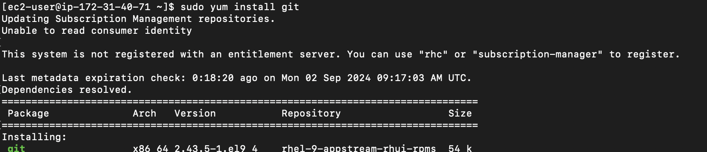
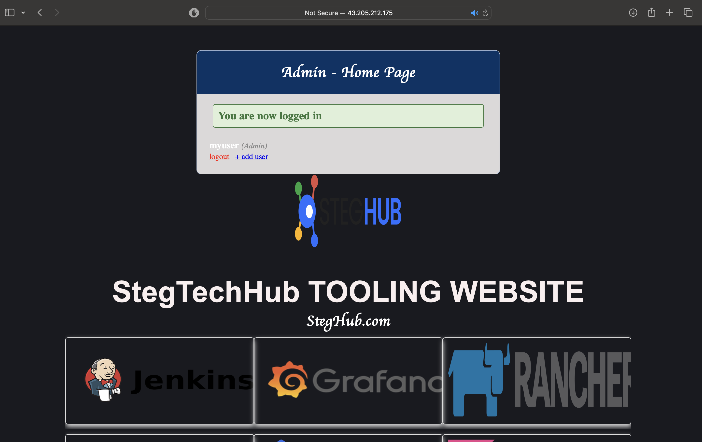

# Devops_Tooling_Website_Solution_101_103

## Devops_Tooling_Website_Solution_101

In this project we will implement a solution that consists of following components:

Infrastructure: AWS
Webserver Linux: Red Hat Enterprise Linux 8
Database Server: Ubuntu 20.04 + MySQL
Storage Server: Red Hat Enterprise Linux 8 + NFS Server
Programming Language: PHP
Code Repository: GitHub


## Devops_Tooling_Website_Solution_102
### Preparaing NFS Server
- First, created an ec2 instance named it as "NFSserver" in a region "Mumbai" with instance type "t2.small", AMI (Amazon Machine Image ) as "Red Hat", at first created security group having inbound rules for (SSH),Http and Https.
- Private key was generated and named it as : "tooling_private_key" and downloaded ".pem" file.
- Used the same private key previously downloaded to connect to EC2 instace via ssh as in previous projects.
  
 
  

- Created 4 volumes in the same Availability zone(ap-south-1a) each of 10 GB for webserver in the EBS inside volume section and attach it to the webserver and another 3 volumes for database_server instance and attached it to the database_server with different device name.
 


### Installing and configuring LVM on the Server
- Created partitions on each disk:
    ```
    sudo gdisk /dev/xvdb
    sudo gdisk /dev/xvdc
    sudo gdisk /dev/xvdd
    sudo gdisk /dev/xvde

    ```
    
- For each command did :
    - Enter n for new partition.
    - Choose default partition number (e.g., 1).
    - Choose default first and last sectors to use the entire disk.
    - Enter w to write partition table to disk.
    - Click y to confirm.

- Update the system
    ```
    sudo yum -y update
    ```

- Install LVM if not already installed
    ```
    sudo yum install lvm2 -y
    ```

- Create Physical Volumes (assuming /dev/xvdf, /dev/xvdg, /dev/xvdh are the attached EBS volumes)
    ```
    sudo pvcreate /dev/xvdf /dev/xvdg /dev/xvdh
    ```

    
    
    


- Create a Volume Group named 'webdata-vg'
    ```
    sudo vgcreate webdata-vg /dev/xvdf /dev/xvdg /dev/xvdh
    ```

- Create Logical Volumes
    ```
    sudo lvcreate -L 10G -n apps-lv webdata-vg
    sudo lvcreate -L 10G -n logs-lv webdata-vg
    sudo lvcreate -L 10G -n opt-lv webdata-vg
    ```
    

- Format the Logical Volumes as XFS
    ```
    sudo mkfs.xfs /dev/webdata-vg/lv-apps
    sudo mkfs.xfs /dev/webdata-vg/lv-logs
    sudo mkfs.xfs /dev/webdata-vg/lv-opt

    ```
    


- Create mount points and mount the Logical Volumes
    ```
    sudo mkdir -p /mnt/apps /mnt/logs /mnt/opt
    ```
    ```
    sudo mount /dev/webdata-vg/apps-lv /mnt/apps
    sudo mount /dev/webdata-vg/logs-lv /mnt/logs
    sudo mount /dev/webdata-vg/opt-lv /mnt/opt
    ```
     

### Installing and configuring the NFS server
- Install NFS utilities
    ```
    sudo yum install nfs-utils -y
    ```
     

- Start and enable NFS service
    ```
    sudo systemctl start nfs-server.service
    sudo systemctl enable nfs-server.service
    sudo systemctl status nfs-server.service
    ```
    

### Exporting the mounts for the web servers subnet
- Check your subnet CIDR from the AWS EC2 console under the Networking tab.
- Edit the /etc/exports file.
- Open the exports file for editing
    ```
    sudo vi /etc/exports
    ```

- Add the following lines 
    ```
    /mnt/apps 172.31.32.0/20
    (rw,sync,no_all_squash,no_root_squash)
    /mnt/logs 172.31.32.0/20 (rw,sync,no_all_squash,no_root_squash)
    /mnt/opt 172.31.32.0/20 (rw,sync,no_all_squash,no_root_squash)
    ```
- Export the NFS shares
    ```
    sudo exportfs -arv
    ```
- Set ownership and permissions
    ```
    sudo chown -R nobody:nobody /mnt/apps /mnt/logs /mnt/opt
    sudo chmod -R 777 /mnt/apps /mnt/logs /mnt/opt
    ```

- Restart NFS service
    ```
    sudo systemctl restart nfs-server.service
    ```

- Open necessary ports in the security group
- Check the ports NFS is using.
    ```
    rpcinfo -p | grep nfs

    ```
    
    


### Preparaing mysql server
- Similary , second EC2 instance was created named it as "mysql_server" in a region "mumbai" with instance type "t2.small", AMI (Amazon Machine Image ) as "ubuntu", at first created security group having inbound rules for (SSH),later on added port 3306 all other required configuration was selected as default here and connected to virtual server using same ".pem" file as the same private key was used for this instance.
 
 
 
 

- Update and Upgrade the Instance
    ```
    sudo apt update && sudo apt upgrade -y

    ```
    
- Install MySQL Server
    ```
    sudo apt install -y mysql-server

    ```
    
- Access the MySQL prompt:
    ```
    sudo mysql
    ```
- Create the database, user, and grant privileges:
    ```
    CREATE DATABASE tooling;
    CREATE USER 'webaccess'@'172.31.32.0/20' IDENTIFIED BY 'password';
    GRANT ALL PRIVILEGES ON tooling.* TO 'webaccess'@'172.31.32.0/20';
    FLUSH PRIVILEGES;
    exit;

    ```
### Bind MySQL to All IP Addresses
- Edit the MySQL configuration file:
    ```
    sudo nano /etc/mysql/mysql.conf.d/mysqld.cnf
    ```
- Find the line:
    ```
    bind-address = 127.0.0.1
    ```
- Change it to:
    ```
    bind-address = 0.0.0.0
    ```
- Restart MySQL to apply the changes:
    ```
    sudo systemctl restart mysql
    
    ```
    

### Preparaing webserver server
- Similary , second EC2 instance was created named it as "web_server" in a region "mumbai" with instance type "t2.small", AMI (Amazon Machine Image ) as "Red Hat", connected to virtual server using same ".pem" file as the same private key was used for this instance.
 
 
 
 

- Update and Upgrade the Instances
    ```
    sudo yum update -y && sudo yum upgrade -y
    ```
- Install NFS Client
    ```
    sudo yum install nfs-utils nfs4-acl-tools -y
    ```

- Create /var/www/ Directory
    ```
    sudo mkdir /var/www
    ```
    
-  Mount /var/www/ to the NFS Server Export
Replace <nfs-server-private-ipv4> with your actual NFS server's private IP address:
    ```
    sudo mount -t nfs -o rw,nosuid 172.31.34.216:/mnt/apps /var/www
    ```
### Make Mount Persistent After Reboot
- Edit the /etc/fstab file:
    ```
    sudo vi /etc/fstab
    ```
- Add the following line:
    ```
    172.31.34.216:/mnt/apps  /var/www nfs defaults 0 0
    ```

### Installing and Configuring REMI Repository, Apache, PHP
    ```
    sudo yum install httpd -y
    sudo dnf install https://dl.fedoraproject.org/pub/epel/epel-release-latest-9.noarch.rpm
    sudo dnf install dnf-utils http://rpms.remirepo.net/enterprise/remi-release-9.rpm
    sudo dnf module reset php
    sudo dnf module enable php:remi-7.4
    sudo dnf install php php-opcache php-gd php-curl php-mysqlnd
    sudo systemctl start php-fpm
    sudo systemctl enable php-fpm
    sudo setsebool -P httpd_execmem 1
    ```


- Verify Files and Directories
    ```
    df -h
    ```
- Create /var/log/httpd/ Directory
    ```
    sudo mkdir /var/log/httpd
    ```

- Mount /var/log/httpd to the NFS Server Export
    ```
    sudo mount -t nfs -o rw,nosuid 172.31.34.216:/mnt/logs /var/log/httpd
    ```

- Edit the /etc/fstab file again:
    ```
    sudo vi /etc/fstab
    ```
- Add the following line:
    ```
    172.31.34.216:/mnt/logs  /var/log/httpd nfs defaults 0 0
    ```
    
    
### Test MySQL Remote Connection from the Web Servers
- Install MySQL Client:
    ```
    sudo yum install mysql -y
    ```
- Connect to MySQL Server:
    ```
    sudo mysql -u webaccess -p -h 172.31.34.216
    SHOW DATABASES;
    ```
    
    

### Deploy the Website to the Web Server
- Install Git:
    ```
    sudo yum install git -y
    ```
    
- Clone the Repository:
    ```
    git clone https://github.com/citadelict/tooling.git
    ```
    
- Move Contents to /var/www/html:
    ```
    sudo mv tooling/html/* /var/www/html/
    ```
- Configure DB Credentials:
1. Make sure the credentials you're using in your mysqli_connect() function are correct. The typical usage is as follows:
    ```
    $connection = mysqli_connect('localhost', 'username', 'password', 'database_name');
    ```
2. Ensure that username, password, and database_name are correct.
3. If you're connecting to a different host (not localhost), ensure that your MySQL server allows connections from that host.
 
- Import the SQL File:
    ```
    mysql -h 172.31.39.146 -u webserver -p < tooling-db.sql
    ```
    
- Create a New Admin User:
    ```
    sudo mysql -u webaccess -p -h 172.31.39.146

    USE tooling;

    INSERT INTO `users` (`id`, `username`, `password`, `email`, `user_type`, `status`) VALUES
    (1, 'myuser', '5f4dcc3b5aa765d61d8327deb882cf99', 'user@mail.com', 'admin', '1');

    exit;

    ```
    
- Restart Apache
    ```
    sudo systemctl restart httpd.service
    ```
- If Apache doesn’t restart, enable NFS usage with SELinux:
    ```
    sudo setsebool -P httpd_use_nfs 1
    sudo setsebool -P httpd_can_network_connect 1
    sudo systemctl restart httpd.service
    ```
    
- Verify Website Access:
http://your-webserver-ip-address/login.php
Log in using the credentials username: myuser and password: password.




